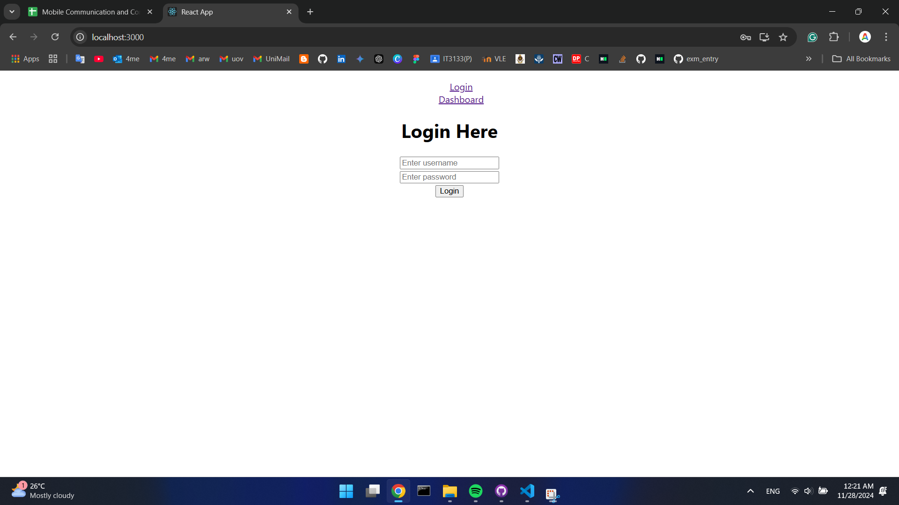

## 2020ICT101
### Practical Date: 26.11.2024
### Practical Number: 08
### Problem Specification: Login and Dashboard Functionality

This project demonstrates a simple login and dashboard functionality using React. The application includes user authentication with basic validations, error handling, and navigation between pages.

### Output
